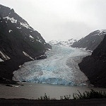
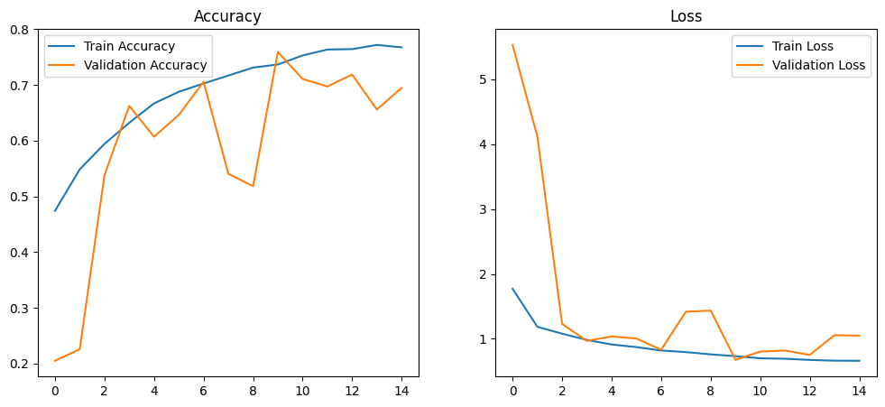
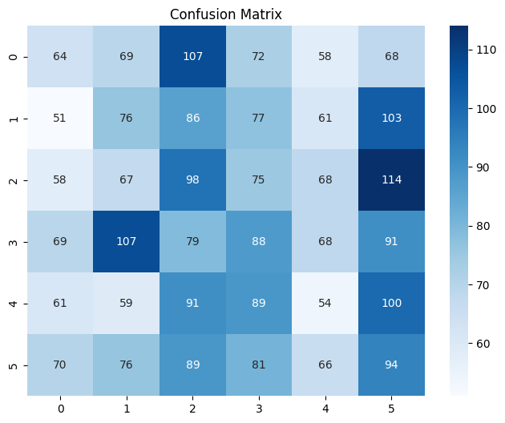

# 🏞️ Intel Image Classification with CNN

Bu proje, **Convolutional Neural Networks (CNN)** kullanarak **Intel Image Classification** veri setindeki 6 farklı sınıfı sınıflandırmayı amaçlamaktadır.

---

## 📂 Proje Yapısı

project/
│── notebooks/
│ └── CNN_Notebook.ipynb # Eğitim süreci ve analizler
│── src/
│ └── model.py # Model tanımı (CNN)
│── results/
│ ├── sample_images/ # Dataset’ten örnek görseller
│ │ ├── forest.jpg
│ │ ├── mountain.jpg
│ │ ├── sea.jpg
│ │ ├── buildings.jpg
│ │ ├── glacier.jpg
│ │ └── street.jpg
│ ├── accuracy_loss.png # Eğitim / doğrulama grafiği
│ ├── confusion_matrix.png # Karışıklık matrisi
│── .gitignore
│── README.md
│── requirements.txt

---

## 📷 Örnek Görseller

  
  
  
  
  
  

---

## ⚙️ Kullanılan Teknolojiler

- Python 🐍  
- TensorFlow / Keras 🤖  
- Matplotlib 📊  
- NumPy 🔢  
- Scikit-learn 📈  

---

## 🚀 Eğitim Sonuçları

### 📊 Accuracy / Loss Grafiği

  

### 📌 Confusion Matrix

  

## 📦 Kurulum

# Gerekli kütüphaneleri yükle
pip install -r requirements.txt

## 📥 Dataset

Intel Image Classification veri setini https://www.kaggle.com/datasets/puneet6060/intel-image-classification üzerinden indirebilirsiniz.

